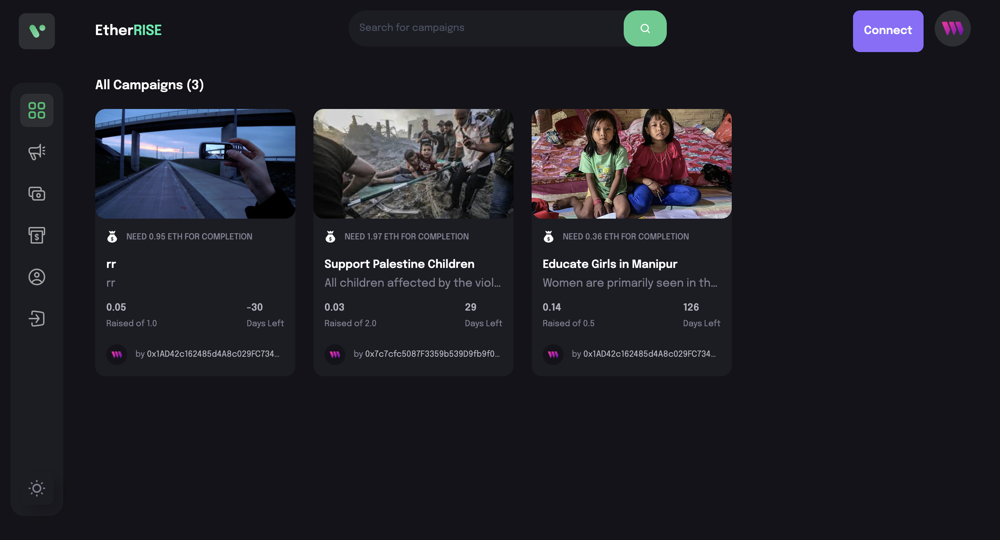
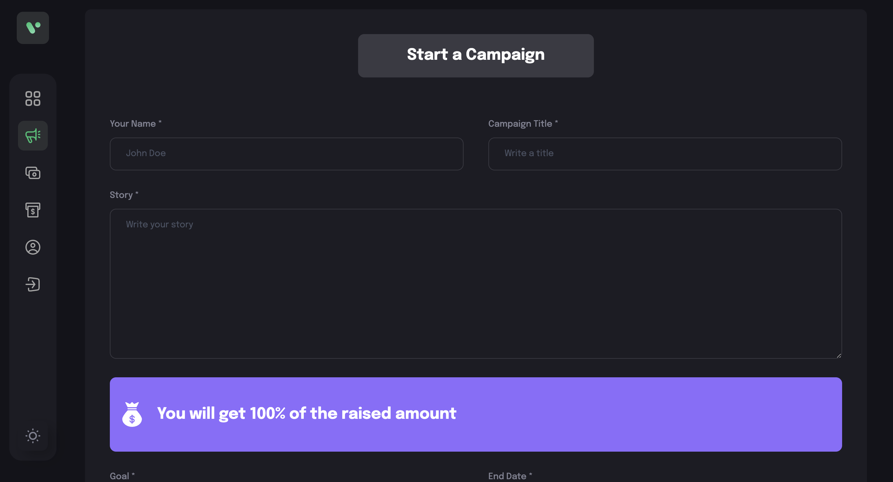
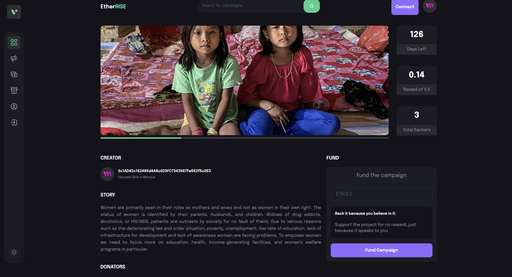

# EtherRise

My EtherRise is a decentralized crowdfunding platform built on Solidity, React, Vite, and Tailwind CSS. It allows users to create campaigns and raise funds using their MetaMask accounts. Users can also donate to campaigns they support.

## About

My EtherRise was created to provide a decentralized and transparent platform for individuals and organizations to raise funds for their projects, causes, or initiatives. By leveraging blockchain technology, we aim to eliminate the need for intermediaries and provide a direct channel for supporters to contribute to campaigns they believe in.

## Features

- Create crowdfunding campaigns
- Accept donations via MetaMask
- View details of campaigns
- Deployed on the Goerli testnet via ThirdWeb platform

## Screenshots

### Homepage

### Start Campaign

### Campaign View

## Technologies Used

- Solidity
- React
- Vite
- Tailwind CSS
- MetaMask
- ThirdWeb platform (for deployment)

## Getting Started

To run this project locally, follow these steps:

1. Clone this repository.
2. Install dependencies using `npm install`.
3. Start the development server using `npm run dev`.
4. Connect your MetaMask wallet to the Goerli testnet.
5. Explore and interact with the application.

## Deployment

The contract is deployed on the Goerli testnet via the ThirdWeb platform. 

## Contributing

Contributions are welcome! Please fork this repository, make your changes, and submit a pull request.

## License

This project is licensed under the MIT License - see the [LICENSE](LICENSE) file for details.
